- [Enteric Neurons](#enteric-neurons)
  - [Consistent Annotations](#consistent-annotations)
  - [Cell2020_snSS2 Colon](#cell2020_snss2-colon)
    - [markers](#markers)
    - [signature score](#signature-score)
  - [NatNeur2021_sc10x SI](#natneur2021_sc10x-si)
    - [markers](#markers-1)
    - [signature score](#signature-score-1)
  - [Wang2025.SI](#wang2025si)
    - [markers](#markers-2)
    - [signature score](#signature-score-2)
  - [Sun2025.SI](#sun2025si)
    - [markers](#markers-3)
    - [signature score](#signature-score-3)
  - [Sun2025.Colon](#sun2025colon)
    - [markers](#markers-4)
    - [signature score](#signature-score-4)

# Enteric Neurons

    ##
    # written by Shaorui, Liu ; 2025.04; liushaorui@mail.bnu.edu.cn/ liushaorui@westlake.edu.cn 
    ##   

## Consistent Annotations

having analyzed several public and internal singlecell data of mouse
enteric neurons,  
we noticed that different datasets could be compared and mapped.

then we believe that  
those neurons from Small Intestine or Colon might be different from each
other,  
but still share similar subtypes with matched markers.

    ####
    ##
    ## Here's our final consistent annotations for Enteric Neuron subytypes: 
    ##   (based on NatNeur2021)
    #
    # EMN1-5   Chat+Bnc2+Tac1+ (1->5, Chat->lower, Tac1->higher)
    #          Penk+Fut9+  EMN5(SI), EMN4/5(Colon) 
    #          dynamic shift, still fine to have 3or4 more
    #
    # IMN1-4   Nos1+Etv1+Vip+ (Vip would raise in IMN3/4)
    #          (NatNeur2021 may have incomplete IMNs with IMN3/4 lost or very few mixed with IPAN3)
    #          dynamic shift, still fine to have 2or3 more
    #
    # IN1      Gal+Cdh10+    
    #
    # IN2      Moxd1+Sctr+
    #
    # IN3      Sst+Vipr2+Piezo1+
    #           Sst+ IN3 is a small individual cluster in SI,  
    #           but in Colon, 
    #           it has much more neurons with heterogeneity (likely into 2or3 subsets) 
    #               and location directly attached to EMN1 on umap (co-express a lot)            
    #
    # IPAN1    Calcb+Nmu+Il7+Cdh6+Cdh8+ 
    #          (very distinctive with many immune regulators on, likely further into two subsets) 
    #
    # IPAN2    Cck+Cdh9+  (likely into two subsets in SI and one closer to IPAN1, might be much smaller in Colon)
    #
    # IPAN3    Calcb+Piezo2+ (like a transient tail of IMN4 on umap, but distinct from IMNs)
    #
    # IPAN4    Skap1+Nxph2+
    #
    ##
    ####

here to show umap and dotplot/vlnplot results from several datasets

    ### datasets
    ### 
    ## public
    #
    # 1. Eugene Drokhlyansky et al. Cell.2020 Sep
    #        DOI: 10.1016/j.cell.2020.08.003
    #      snSS2 - Colon    Multiple Conditions
    #
    # 2. Khomgrit Morarach et al. NatNeurosci.2021 Jan  
    #        DOI: 10.1038/s41593-020-00736-x 
    #      sc10x - Small Intestine
    #
    ## internal
    #
    # 3. Yinsheng Wang et al. Immunity2025 Feb
    #        DOI: 10.1016/j.immuni.2025.01.004
    #      sn10x - Small Intestine    N.b infection, Il13ra1-CKO
    #
    # 4. Zijia Sun et al. CellRep.2025 Apr 
    #        DOI: 10.1016/j.celrep.2025.115524 
    #      sn10x - Small Intestine/ Colon    C.R infection, Ahr-CKO
    ##
    ###
    ##
    # for neurons, single-nucleus datasets indeed have better quality with intact nuclei
    #     however, the RNA abundance is as thin as around 1/10 of total transcriptome afterall
    #       some markers get much easier to drop out, like Cck
    #
    # so, single-cell datasets still have their values to be as a good reference
    #
    ##
    ###
    ##
    # about the consistent annotations, those papers also had critical discussions  
    #      Rasa Elmentaite et al. Nature.2021 Sep - Peer Review File
    #          DOI: 10.1038/s41586-021-03852-1
    #      Homa Majd et al. bioRxiv.2024 Feb
    #          DOI: 10.1101/2024.01.15.575794
    ##
    ###

##### about signature score calculation

using top120-built top markers from internal integrated SI data  
(duplicated markers only keep one for the most significant subtype)

## Cell2020_snSS2 Colon

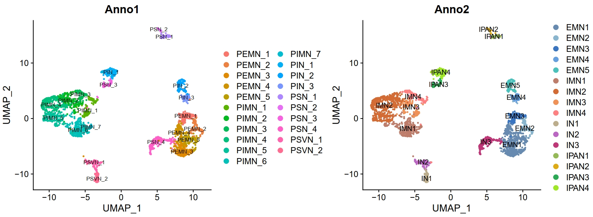

### markers

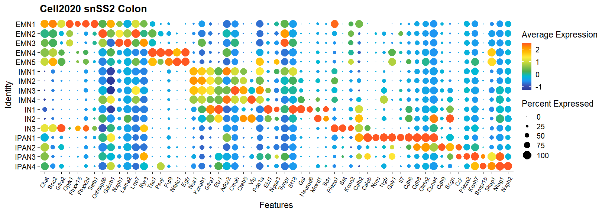

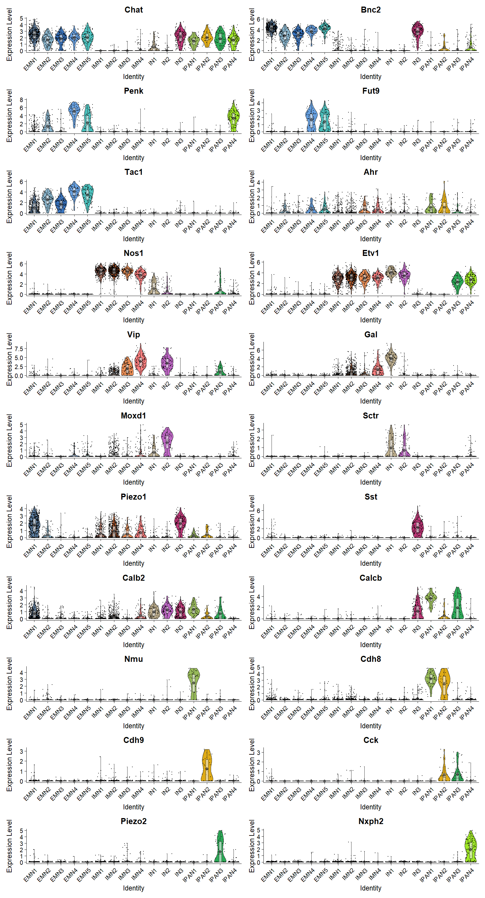

### signature score

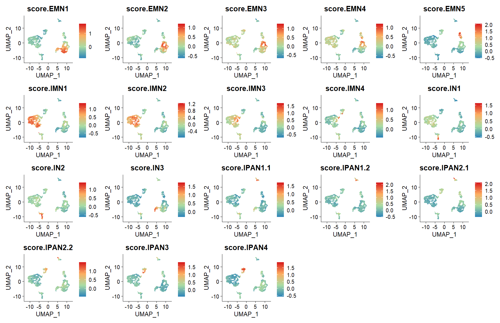

## NatNeur2021_sc10x SI

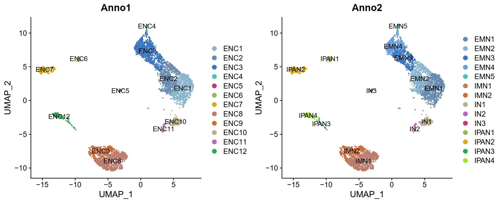

### markers

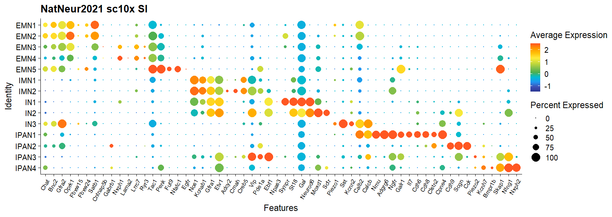

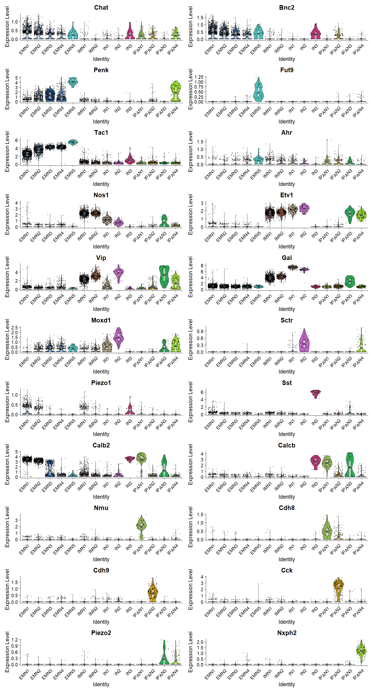

### signature score

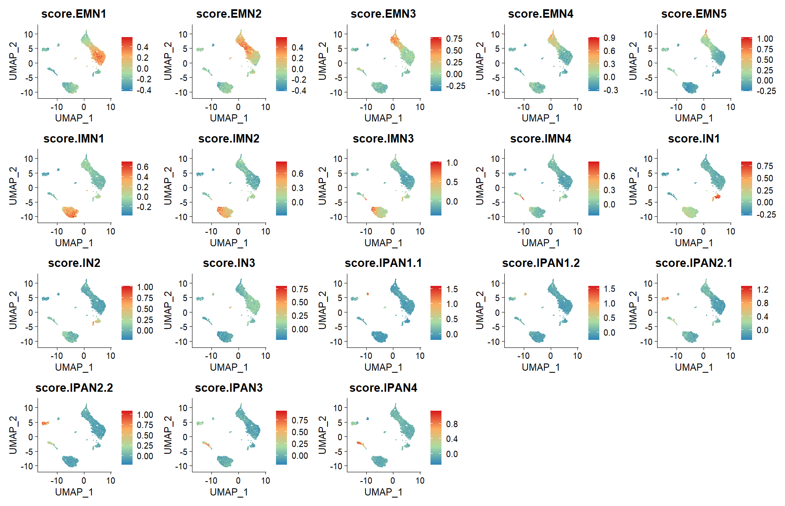

## Wang2025.SI

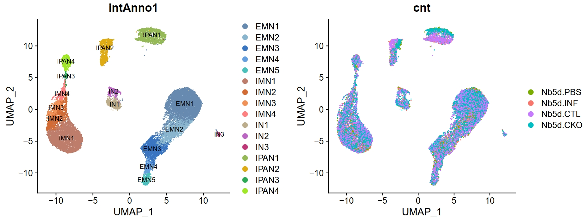

### markers

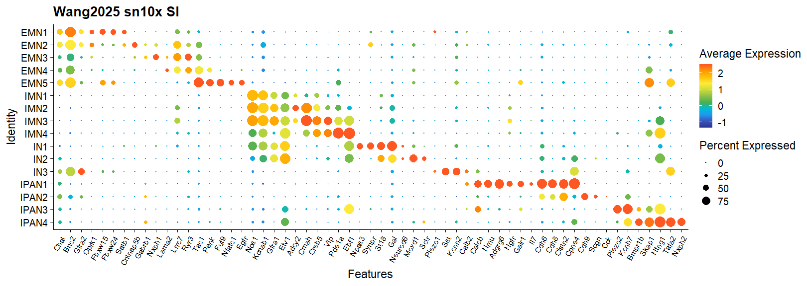

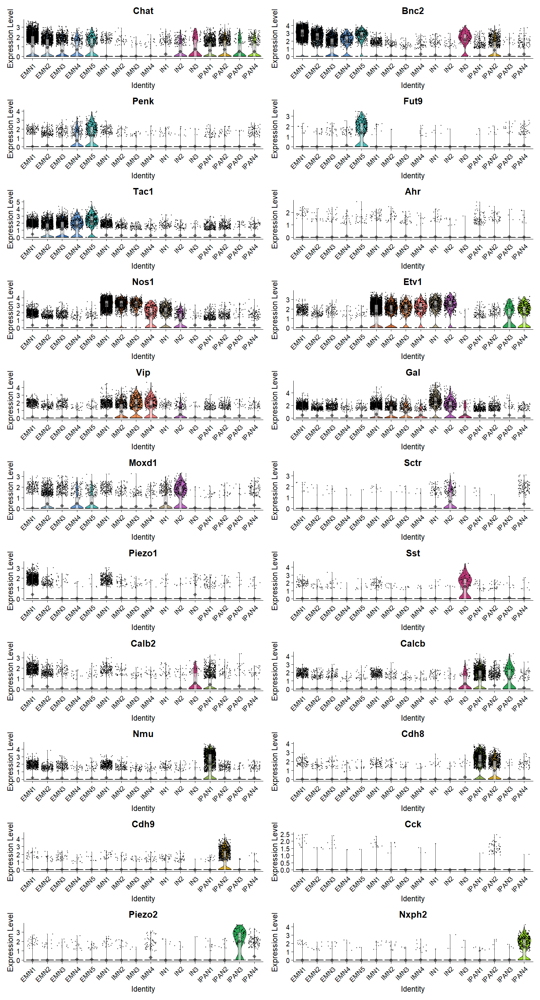

### signature score

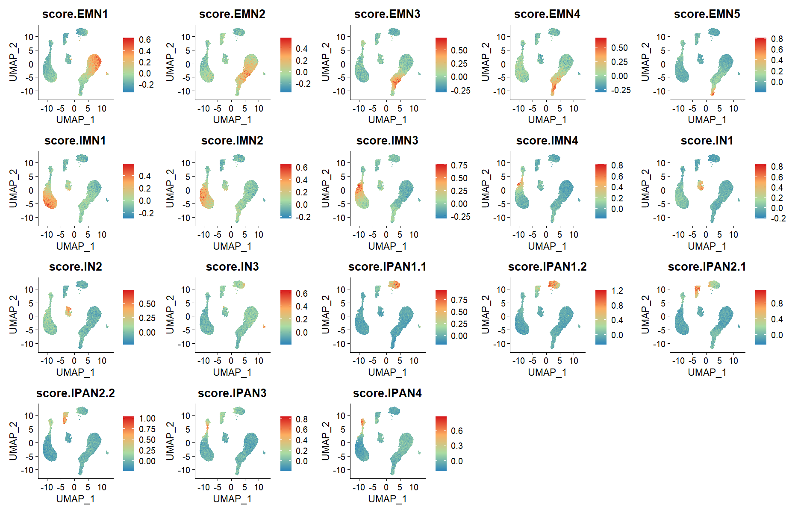

## Sun2025.SI

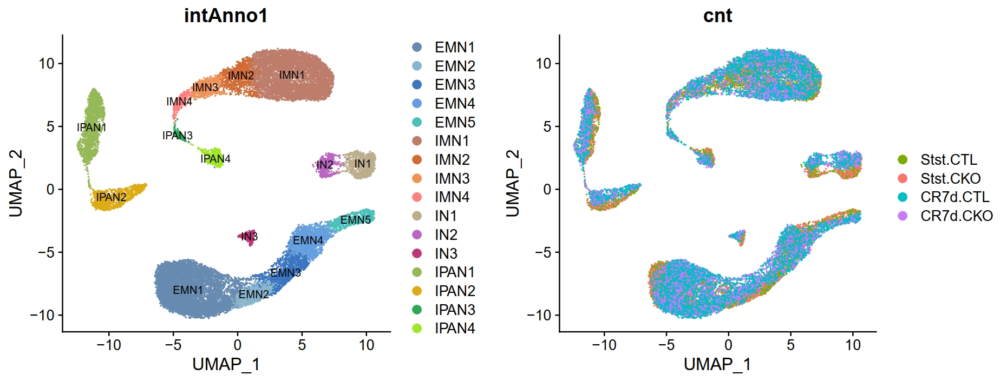

### markers

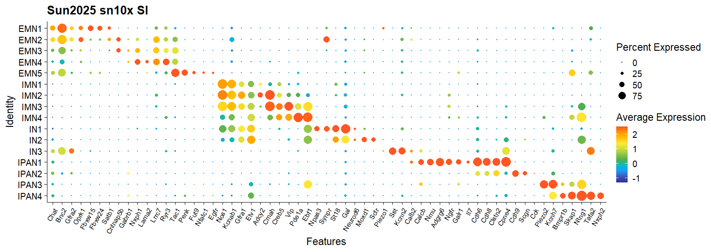

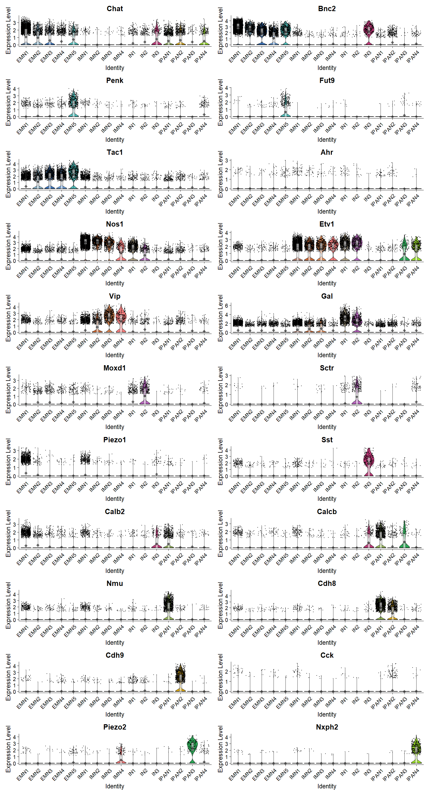

### signature score

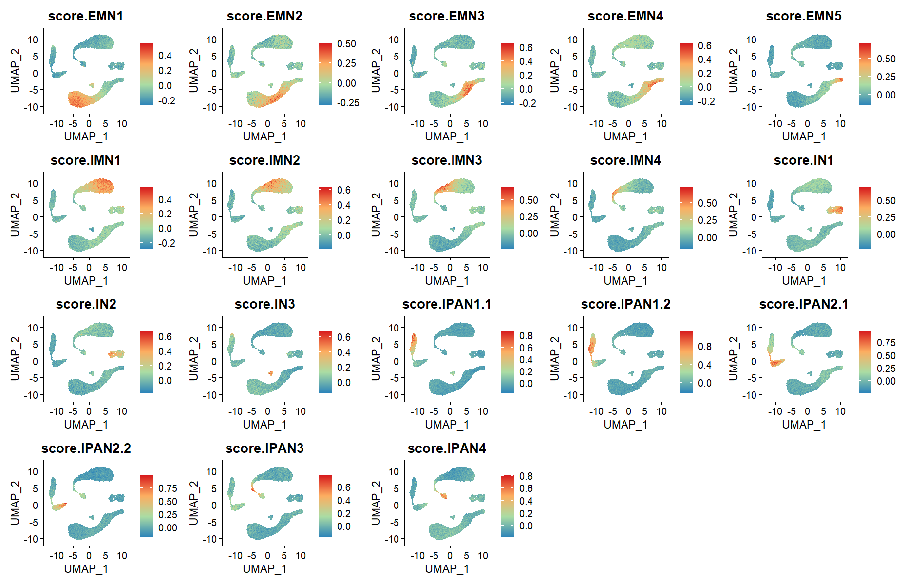

## Sun2025.Colon

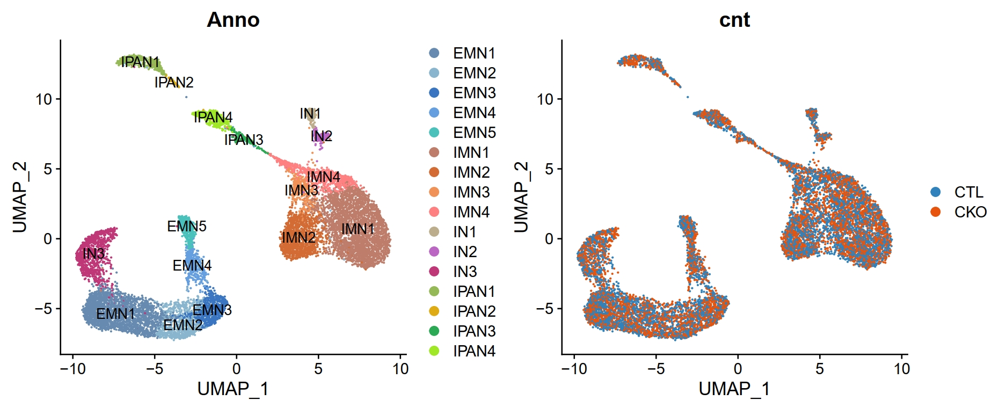

### markers

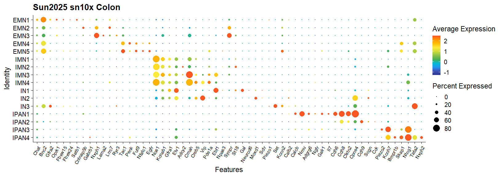

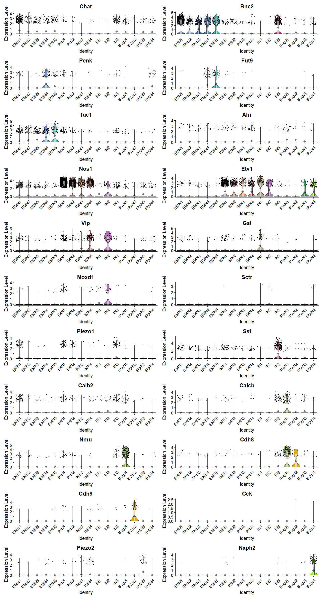

### signature score

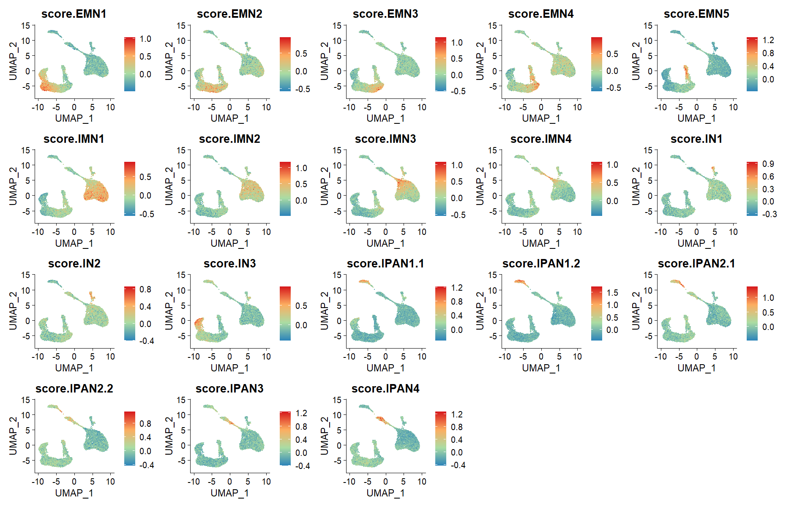
